# Attention mechanism 기반 블로우 성형 공정 불량 Detection
2023 성균관대학교 기계공학부 학부학술제 우수상상

## **Yolo-ResNet**

- Augmentation
    
    *ImageNet pretrained
    
    *aug factor:20 ⇒ train 4200장, valid 720장
    
    - 성능
    
      mAP30 = 0.51
    
      mAP50 = 0.35
    
    - 학습추이
    
    [https://wandb.ai/urp/yolo_resnet_neck?workspace=user-gomduribo](https://wandb.ai/urp/yolo_resnet_neck?workspace=user-gomduribo)
    
    → YOLO_RESNET18_neck_LR0.0001_AUG20 참고
    
    - 결과 이미지
    
    형광초록색: annotation
    
    파란색: prediction
    
    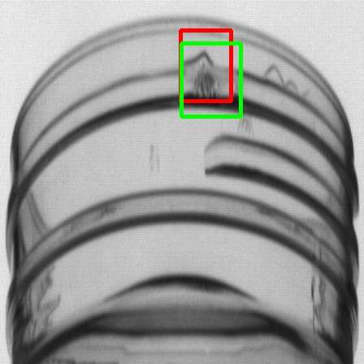 |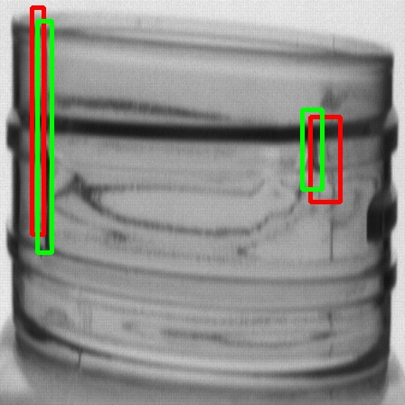
    --- | --- |    

## **Yolo-Swin**

- **Augmentation**

     *ImageNet pretrained

*aug factor:20 ⇒ train 4200장, valid 720장

- 성능

mAP30 = 0.61

mAP50 = 0.40

- 학습추이

[https://wandb.ai/urp/yolo_swin_neck?workspace=user-gomduribo](https://wandb.ai/urp/yolo_swin_neck?workspace=user-gomduribo)

→ YOLO_SWIN_T_neck_LR0.0001_AUG20 참조

- 결과 이미지

/workspace/Plastic_Bottle_defect_detection/results/boxed_images/YOLO_SWIN_T_neck_LR0.0001_AUG20/

형광초록색: annotation

파란색: prediction

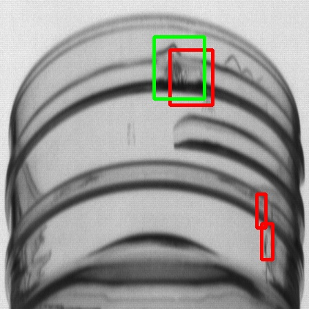 |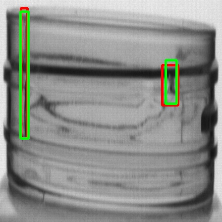
--- | --- |

- **Image Patching**
    
    *ImageNet pretrained
    
    *patch factor:50 ⇒ train 10500장, valid 1800장
    
    - 성능
    
    mAP30 = 0.57
    
    mAP50 = 0.42 
    
    - 학습추이
    
    [https://wandb.ai/urp/yolo_swin_neck_IMAGE_PATCH?workspace=user-gomduribo](https://wandb.ai/urp/yolo_swin_neck_IMAGE_PATCH?workspace=user-gomduribo) 
    
    → YOLO_SWIN_T_neck_LR0.0001_Image_Patch50 참조
    
    - 결과 이미지
    
    /workspace/Plastic_Bottle_defect_detection/results/boxed_images/YOLO_SWIN_T_neck_LR0.0001_Image_Patch50/
    
    형광초록색: annotation
    
    파란색: prediction
    
    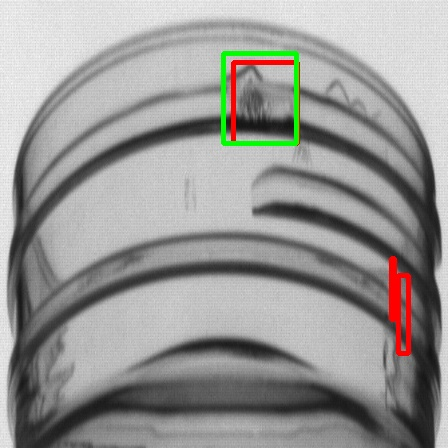 |
    --- | --- |

- **Image Patching & Augmentation**
    
    *ImageNet pretrained
    
    *patch factor:50+aug factor:4 ⇒ train 42000장, valid 7200장
    
    - 성능
    
      mAP30 = 0.81
    
      mAP50 = 0.75
    
    - 학습추이
    
    [https://wandb.ai/urp/yolo_swin_neck_IMAGE_PATCH/workspace?workspace=user-gomduribo](https://wandb.ai/urp/yolo_swin_neck_IMAGE_PATCH/workspace?workspace=user-gomduribo)
    
    →YOLO_SWIN_T_neck_LR0.0001_IP50_AUG4 참조
    
    - 결과 이미지
    
    형광초록색: annotation
    
    파란색: prediction
    

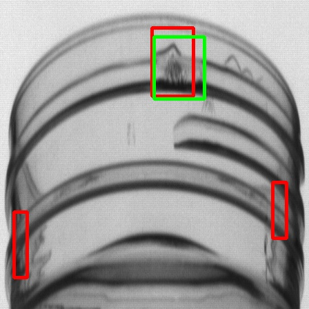 |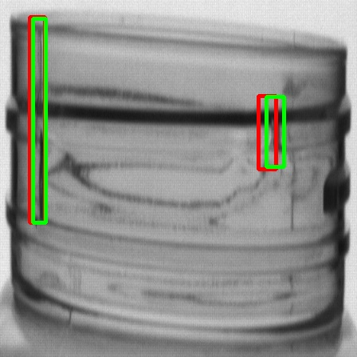
--- | --- |

- **Image Patching & Augmentation2**
    
    *radio data pretrained
    
    → stray와 target이라는 두가지 class로 이뤄진 데이터셋
    
    → 배경에 noise가 많고 객체가 작다는 점에서  현재 detection 적용하려는 neck 데이터셋과 유사하다고 판단
    
    *patch factor:50+aug factor:4 ⇒ train 42000장, valid 7200장
    
    - 성능
    
      mAP30 = 0.76
    
      mAP50 = 0.35
    
    - 학습추이
    
    [https://wandb.ai/urp/yolo_swin_neck_IMAGE_PATCH/workspace?workspace=user-gomduribo](https://wandb.ai/urp/yolo_swin_neck_IMAGE_PATCH/workspace?workspace=user-gomduribo)
    
    →YOLO_SWIN_T_neck_LR0.0001_IP50_AUG4 참조
    
    - 결과 이미지
    
    형광초록색: annotation
    
    파란색: prediction
    
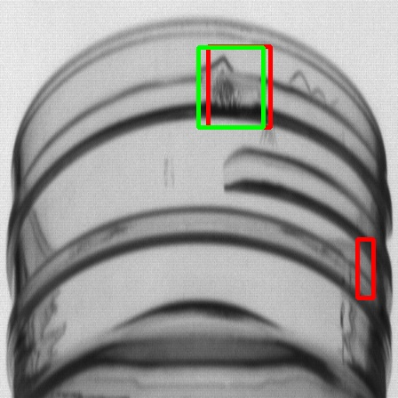 |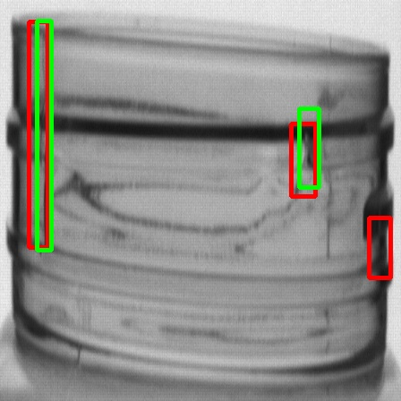
--- | --- |

## Yolo-CBAM

*CBAM?

→ github: https://github.com/Jongchan/attention-module

→ paper: [https://arxiv.org/pdf/1807.06521v2.pdf](https://arxiv.org/pdf/1807.06521v2.pdf)

- Image Patching
    
    *ImageNet pretrained
    
    *patch factor:50 ⇒ train 10500장, valid 1800장
    
    - 성능
    
    mAP30 = 0.55
    
    mAP50 = 0.08
    
    - 학습추이
    
    [https://wandb.ai/urp/yolo_cbam_neck_IMAGE_PATCH?workspace=user-gomduribo](https://wandb.ai/urp/yolo_cbam_neck_IMAGE_PATCH?workspace=user-gomduribo)
    
    → YOLO_RESNET_CBAM_neck_LR0.0001_IP50_Pretrained 참조
    
    - 결과 이미지

      형광초록색: annotation
    
      파란색: prediction
    
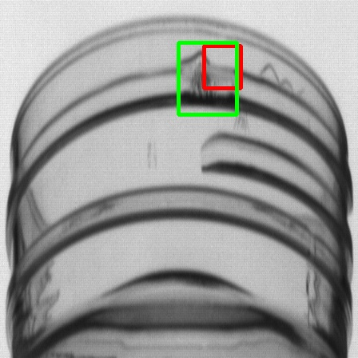 |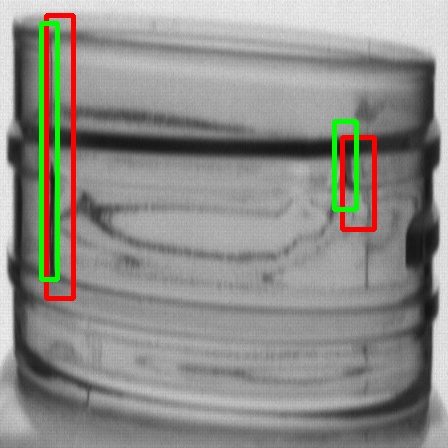
--- | --- |    

