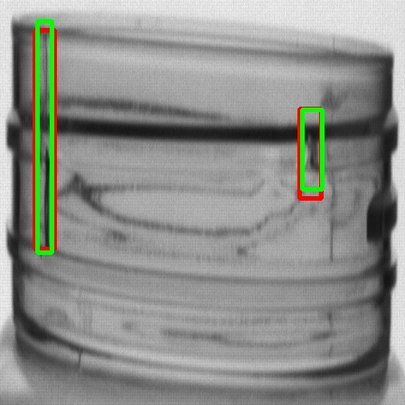

# Attention mechanism 기반 블로우 성형 공정 불량 Detection

## **Neck**

### **Yolo-ResNet**

- Augmentation

- Image Patching

- Image Patching & Augmentation

### **Yolo-Swin**

- Augmentation
    
    *factor: 20
    
    - 성능
    
    mAP30 = 0.61
    
    mAP50 = 0.40
    
    - 학습추이
    
    [https://wandb.ai/urp/yolo_swin_neck?workspace=user-gomduribo](https://wandb.ai/urp/yolo_swin_neck?workspace=user-gomduribo)
    
    → YOLO_SWIN_T_neck_LR0.0001_AUG20 참조
    
    - 결과 이미지
    
    /workspace/Plastic_Bottle_defect_detection/results/boxed_images/YOLO_SWIN_T_neck_LR0.0001_AUG20/
    
    파란색: annotation
    
    형광초록색: prediction
    
    
    
    
    

- Image Patching
    
    -성능
    
    mAP30 = 0.57
    
    mAP50 = 0.42 
    
    - 학습추이
    
    [https://wandb.ai/urp/yolo_swin_neck_IMAGE_PATCH?workspace=user-gomduribo](https://wandb.ai/urp/yolo_swin_neck_IMAGE_PATCH?workspace=user-gomduribo) 
    
    → YOLO_SWIN_T_neck_LR0.0001_Image_Patch50 참조
    
    - 결과 이미지
    
    /workspace/Plastic_Bottle_defect_detection/results/boxed_images/YOLO_SWIN_T_neck_LR0.0001_Image_Patch50/
    
    파란색: annotation
    
    형광초록색: prediction
    
    
    
    
    

- Image Patching & Augmentation

### Yolo-CBAM

- Augmentation

- Image Patching

- Image Patching & Augmentation

## Body

### Yolo-ResNet

- Augmentation

- Image Patching

- Image Patching & Augmentation

### Yolo-Swin

- Augmentation

- Image Patching

- Image Patching & Augmentation

### Yolo-CBAM

- Augmentation

- Image Patching

- Image Patching & Augmentation
